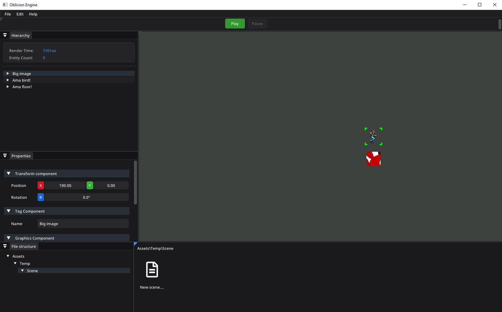

# Oblivion Game Engine

<!-- Add your logo/banner here -->
<!--  -->

A modern 2D game engine built with C++, SFML, and ImGui featuring an intuitive editor with ECS architecture.

## Screenshots

### Editor Interface


*Modern dark theme with dockable panels, hierarchy view, and properties inspector*

## Features

- **Entity Component System (ECS)** - Efficient component-based architecture with O(1) lookups
- **Modern Editor UI** - Professional dark theme with rounded corners and color-coded elements
- **Real-time Physics** - Powered by Box2D
- **Scene Management** - Save/load scenes with YAML serialization
- **Visual Hierarchy** - Tree view of all entities and components
- **Properties Inspector** - Edit entity properties with intuitive controls
- **Play/Pause/Stop** - Test your game directly in the editor

## Installation

### Prerequisites
- Visual Studio 2022
- Git with submodules support

### Clone

```bash
git clone --recurse-submodules -j8 https://github.com/DarkDestroyer2499/Game
```

### Build

Simply run the build script:
```bash
Build.bat
```

## Quick Start

1. Run the editor from Visual Studio or the compiled executable
2. Create entities from the menu bar
3. Add components (Transform, Graphics, Physics, etc.)
4. Press Play to test your scene
5. Save your scene (File → Save as...)

## Project Structure

```
Game/
├── src/
│   ├── Core/           # Engine core systems
│   ├── Editor/         # Editor UI components
│   └── Util/           # Utility functions
├── lib/                # External libraries (SFML, Box2D, ImGui, yaml)
├── resources/          # Fonts and assets
└── docs/              # Documentation and images
```

## Technologies

- **C++17** - Modern C++ features
- **SFML 2.5.1** - Graphics and windowing
- **Box2D** - Physics simulation
- **ImGui** - Immediate mode GUI
- **yaml-cpp** - Scene serialization